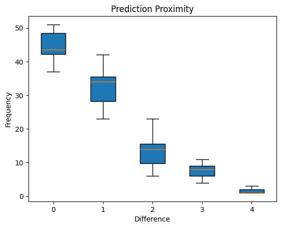

# Can Audio Features Alone Predict Song Enjoyment?

## Background

With millions of songs at a user’s fingertips, the abundance of choice can be overwhelming for users to find new music that aligns with their tastes. Music services like Spotify employ systems such as content-based filtering to recommend content based on its similarity with content the user already enjoys. Despite the impressive capabilities of these recommendation systems, they often function as "black boxes" for companies to preserve their methods and data. Thus, users are frequently given recommendations that may seem misaligned with their tastes because of these recommendation systems' complex combination of multiple methodologies (Chopade et al., 2024). Music discovery is also a very collaborative process, with the sharing of songs being a common practice. Current offerings fail to consider this social aspect when developing recommendations, ignoring what is a significant part of music exploration.

Given these challenges, our project utilizes content-based filtering techniques, using Random Forest and Decision Trees, to create a more direct music recommendation model based on secondary song attributes (not artist, genre, lyrics, etc.). Utilizing song metrics provided by Spotify, such as valence, tempo, and lyricism, we aim to create a model that offers the likelihood of enjoyment based solely on the audio features of their listening history. The goal is to discover to what extent these audio features predict song enjoyment since recommendation engines lean more heavily on artist and genre information (Perera et al., 2020). We focus on developing a program that estimates the probability of a user enjoying a particular song while outputting the most sonically similar songs in the user’s library to serve as a pre-screening step for shared songs. When a friend shares a song, this tool helps users understand what to expect and decide if it’s worth listening to.

## Methods

### Spotify API

To get our data, we used the Spotify API. This allowed us to create a system where users could log in with their Spotify account, and then every song they listened to in the past year and its audio features would be returned. We used 3 API endpoints: Get User’s Top Items, Get Several Tracks’ Audio Features, Search For Item. When used together, this gave us a JSON file with thousands of songs along with their features, ordered by how many times the user listened to the songs.

### Pre-Processing

We assign labels based on song listen count ranks using five quantiles. So, the users' top 20% of most listened to songs are assigned a label of 0, the 20th-40th percentile are assigned a label 1, etc. We turn continuous features into categoricals using quartiles to perform our modeling process more efficiently. Audio feature columns and labels were selected to generate training and testing data using random sampling.

### Decision Tree 

We use all available variables to fit a multi-class decision tree and predict one of the five labels. Our decision tree uses maximum information gain to determine the best split. To analyze the findings, we display a prediction proximity table showing the counts of the differences in true and predicted labels. For example, 40 predictions matched the true label, 32 were off by 1, etc.. We also output a confusion matrix, accuracy, and other performance metrics. The multi-class context means that these conventional metrics are not very useful, so we also dichotomize the results into “like” and “dislike” (predicted labels of 0 or 1 mean “like”) to enable binary metrics which do better to judge the quality of the results. We further compute a normalized mean absolute error as a proximity score to quantify how far the predictions are from the true labels. A feature importance ranking is also output giving the user a sense of which audio features are most important to them. This ranking is based on the average depth of the features in the tree. A lower depth (closer to the root) indicates higher importance because features at the top have more information gain, splitting the data earlier, providing greater predictive power for song enjoyment compared to those appearing deeper in the tree.

### Random Forest

To extend the decision trees, we use random forests. First, we tune hyperparameters for the number of trees and maximum depth of individual trees. To do this, we run a grid search with 5-fold cross-validation. The best tune, with a cross-validation mean accuracy of 0.427, consisted of 150 trees and a max depth of 5. Samples were bootstrapped by sampling with replacements from our full dataset. We fit each decision tree on separate bootstrapped data and predict labels from said trees. For our random forest predictions, we choose the majority label of all its trees as the final predicted label. We then calculate a proxy for the likelihood of enjoying a song by dividing the mean of all the trees’ predictions by the number of labels. That means that an average predicted label of 1.5, for example, results in a 62.5% likelihood of song enjoyment.

### Cosine Similarity	

Another feature allows the user to see how sonically similar a song is to any other song and find the most similar one that they have listened to. We do this using the cosine similarity formula, where A is the given song, and B is all the songs:

## Results
Our random forest model’s performance varies across evaluation approaches. Using traditional metrics, it had an accuracy of 0.448, recall of 0.438, precision of 0.404, and an F1 score of 0.394. However, when we dichotomized the predicted labels into the binaries of “like” or “dislike” to account for the multi-class context, the metrics improved, indicating that the predictions were better than the original metrics suggested. The binary accuracy was 0.771, recall was 0.935, precision was 0.664, and F1 score was 0.775. 

Analyzing our prediction accuracy revealed that 44.8% of predictions correctly matched the label, and an additional 32.5% were off by just one category, meaning that 77.3% of all predictions were either correct or only one category away from the true label. Our proximity score metric, based on a normalized mean absolute error, achieved a score of 0.778. This distribution is visualized in Figure 1 and shows a clear concentration of correct or near-correct predictions, with the frequency decreasing for inaccuracies. 

Figure 1: Chart of the distribution of the prediction differences from the correct label. Demonstrates that the vast majority of the predictions are correct or close.

Our random forest model’s ability to predict song enjoyment within one category 77.3% of the time is noteworthy, given that we only utilized audio features for prediction. Such predictive ability suggests that, although music preference is subjective and complex, audio characteristics play a substantial role in determining song enjoyment.

## Conclusions
The result that audio features alone can go a long way to predicting song enjoyment is significant. While one would struggle to find a non-audiophile who can comment on the valence of a song, for example, it is interesting that perhaps subconsciously, people can pick up on these minor, seemingly insignificant aspects of music, affecting their enjoyment of a given song. 

# Instructions
The primary solution code is in solution.py. To run, type `python solution.py -n 100` in the console. `-n` indicates how large the sample (test) group should be. To use search functionality add `-s "Song Name"`. This will only search from among the existing data due to the recent API changes that limit our access to Spotify data. The code for the audio feature fetch and old search functionality (pre API change) remains in the code but is no longer called. `-t` indicates how many tests to run so `-t 10` for example will run 10 tests and output the average of the metrics across the tests.

Running the code will not work without out Spotify secrets which are not included in this repository. To bypass the Spotify integration comment out Step 2 and Step 4 in the solution and add the following lines after Step 4:

`tests = int(args.tests)`

`test_song = tracks.loc[tracks["track_id"] == None]`

This will disable the search functionality but will not functionally alter anything else because, after the API changes, we are no longer pulling Spotify data and are, instead, pulling from our previously pulled data in tracks.json